<style>
img{
    width: 70%;
    padding-left: 30%;
}
</style>

# 系列管理

系列管理包括添加离心泵系列、添加轴流泵系列、编辑系列、移动系列、删除系列。

&emsp;

## 添加泵系列

以添加离心泵系列为例：

- 第一步，在泵列表下选中类型

- 第二步，单击鼠标右键，选择“添加离心泵系列”

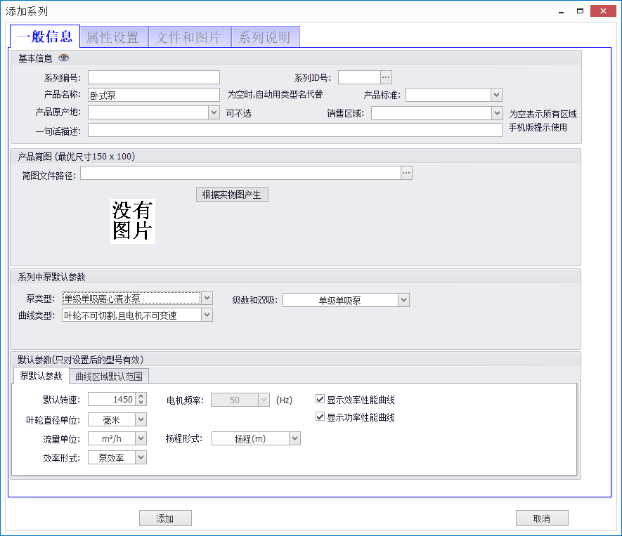

- 第三步，填写系列信息

&emsp;

### *一般信息*

在“一般信息”栏中需要填写系列名称，选择运用行业，设置水泵默认参数和图表默认参数。

&emsp;

### *水泵类型*

首先选择泵类型，多级泵需要在右侧勾选，下面在默认参数栏会出现多级泵默认参数项供选择。然后选择曲线类型，结构类型。“叶轮不可切割，且电机不可变速”只具有单线型谱；“电机可变速”有变速型谱；“叶轮可切割”具有切割和变速型谱。

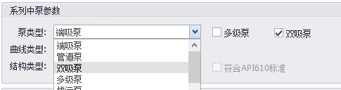

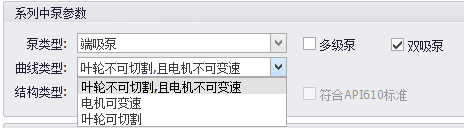

&emsp;

### *泵默认参数*

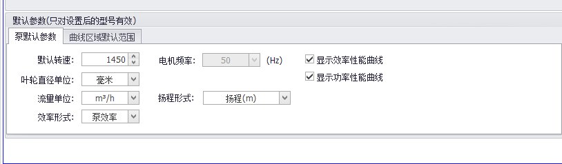

&emsp;

### *曲线区域默认范围*

水泵类型选择不同。图表内容会有所不同，具体如下图：

- 水泵类型为叶轮不可切割，电机不可变速，其中允许区域范围为选型时的型谱范围。

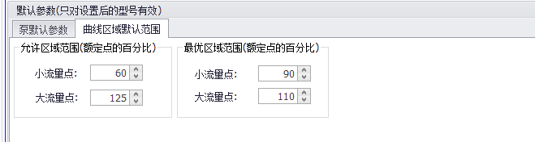

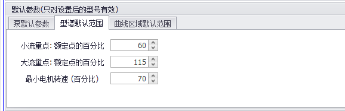

- 水泵类型为叶轮可切割

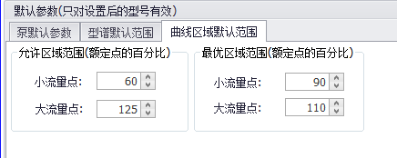

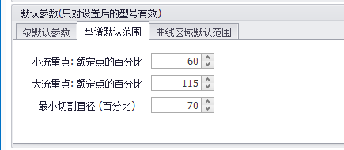

&emsp;

### *属性设置*

在属性设置栏里勾选本系列的属性，属性勾选完成后点击左下角添加即可。

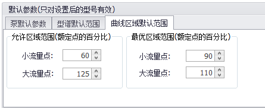

&emsp;

### *文件和图片*

文件和图片包括产品实物图、默认安装图、产品结构图、外形尺寸图。

- 产品实物图，红色框中所选，可以识别大部分图片格式，上传完成后，点击“生成简图”按钮可生成简图。

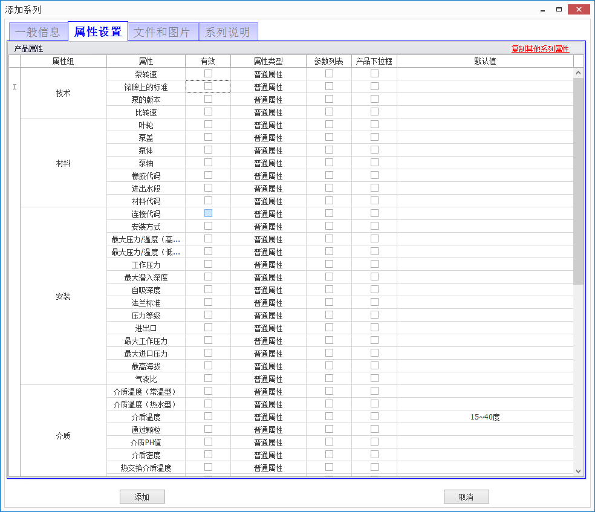

安装尺寸图，红色框中所选，可以上传图片和CAD文件

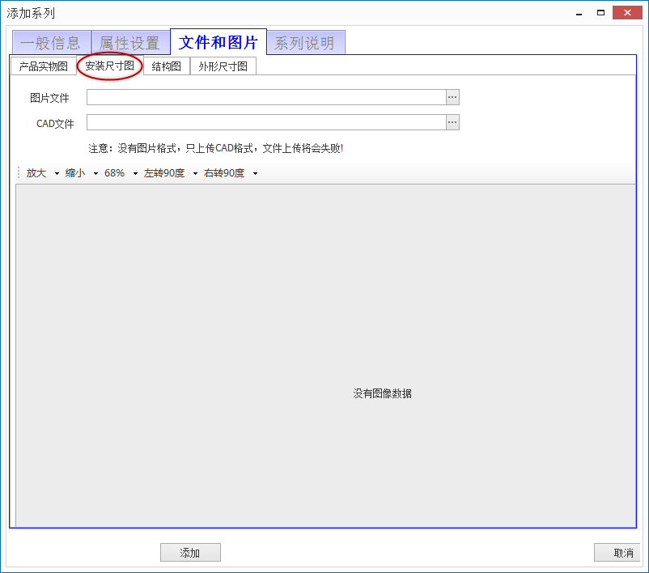

- 结构图，红色框中所选，可以上传图片和CAD文件，展示产品的爆炸图。

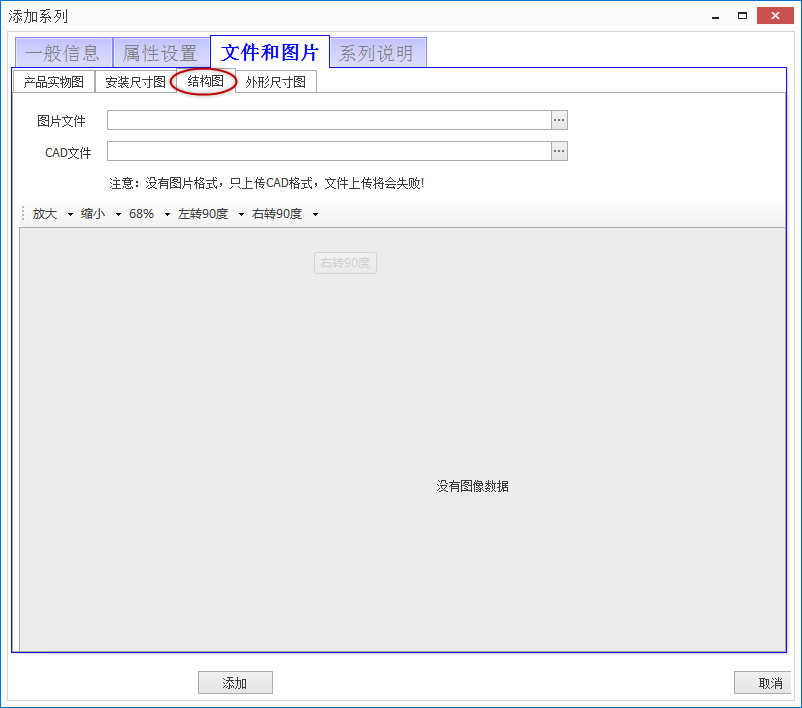

- 外形尺寸图，红色框中所选，可以上传图片和CAD文件（当该系列下所有产品共用一张安装图时，在此上传，一般不推荐在此处上传）


&emsp;

### *系列说明*

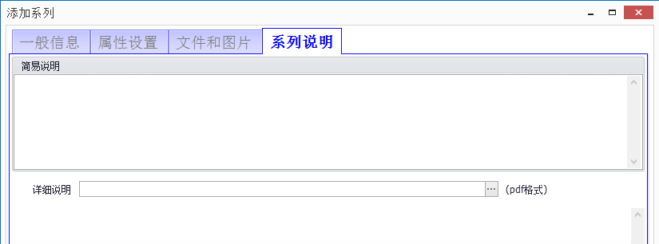

- 填写完系列信息后，点击左下方“添加”按钮，完成对离心泵系列的添加。

>
> <font color=#9CAEE2>例如现添加一个DFSS双吸泵系列：</font>
>
 - 在已添加的类型上单击鼠标右键选择“添加离心泵系列”（或者在菜单栏上点击“添加离心泵系列”），进入添加界面，填写一般信息，然后在属性设置里勾选相对应的属性。如下图所示：

 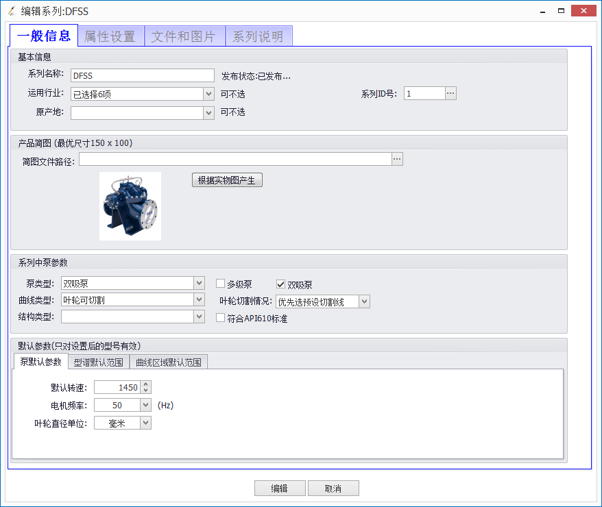

 ```
 📌注意：添加的系列是否叶轮可切割或者可电机变速或者都不可，是否是多级泵，是否是遵循API标准。
 ```


## 删除系列


## 移动系列